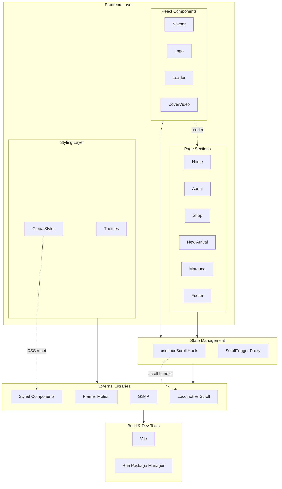

# 🔥 Wibe Studio - Fashion Studio Website

> A stunning, modern fashion studio website built with **React 19**, **Vite**, **GSAP**, **Framer Motion**, and **Locomotive Scroll**.

[](https://github.com/girishlade111/wibe-studio.git)
[](https://github.com/girishlade111/wibe-studio.git)
[](LICENSE)
[](https://bun.sh)

---

## ✨ Demo

> **Live Demo:** [https://wibe-studio.netlify.app/](https://wibe-studio.netlify.app/)

---

## 📋 Table of Contents

- [🛠️ Tech Stack](#tech-stack)
- [🚀 Features](#features)
- [📦 Installation](#installation)
- [⚡ Available Scripts](#available-scripts)
- [🏗️ System Architecture](#system-architecture)
- [📂 Project Structure](#project-structure)
- [🔧 Configuration](#configuration)
- [📊 Stats](#stats)
- [📚 Resources Used](#resources-used)
- [🤝 Contributing](#contributing)
- [📄 License](#license)

---

## 🛠️ Tech Stack

| **Category** | **Technology** | **Version** |
|-------------|----------------|-------------|
| **Framework** | React | `19.2.5` |
| **Build Tool** | Vite | `8.0.10` |
| **Package Manager** | Bun | `1.2.0` |
| **Routing** | React Router DOM | `7.14.2` |
| **Animations** | GSAP | `3.15.0` |
| **Animations** | Framer Motion | `12.38.0` |
| **Scroll** | Locomotive Scroll | `4.1.4` |
| **Scroll Wrapper** | React Locomotive Scroll | `0.2.2` |
| **Styling** | Styled Components | `6.4.1` |
| **Fonts** | @fontsource/kaushan-script | `5.2.8` |
| **Fonts** | @fontsource/sirin-stencil | `5.2.8` |
| **Normalize** | normalize.css | `8.0.1` |

---

## 🚀 Features

### Core Features
- **🎞️ Smooth Scrolling** — Powered by Locomotive Scroll for buttery-smooth scroll experience
- **✨ Rich Animations** — GSAP + Framer Motion for complex, performant animations
- **📱 Responsive Design** — Fully responsive across all devices (mobile, tablet, desktop)
- **🖼️ Cover Video** — Immersive hero section with background video
- **🔄 Page Transitions** — Smooth transitions between routes
- **🎨 Styled Components** — CSS-in-JS for scoped, dynamic styling

### UI/UX Highlights
- **👀 Eye-catching Hero** — Full-screen video with animated overlays
- **🏷️ Marquee Effect** — Scrolling text banner for brand messaging
- **📰 New Arrivals** — Product showcase with hover effects
- **🛍️ Shop Section** — Product grid with elegant cards
- **ℹ️ About Page** — Brand story with parallax effects
- **📬 Newsletter** — Email subscription form
- **🔝 Navigation** — Fixed navbar with smooth scroll links

### Performance
- **⚡ Lightning Fast** — Vite HMR for instant updates
- **🌊 Lazy Loading** — Optimized asset loading
- **📉 Small Bundle** — Minimal footprint with tree-shaking

---

## 📦 Installation

### Prerequisites
- **Bun** — Fast JavaScript runtime (recommended)
  ```bash
  # Install Bun (macOS/Linux)
  curl -fsSL https://bun.sh/install | bash

  # Install Bun (Windows - via PowerShell)
  powershell -Command "irm bun.sh/install.ps1 | iex"

  # Or use npm
  npm install -g bun
  ```

### Clone & Setup

```bash
# Clone the repository
git clone https://github.com/girishlade111/wibe-studio.git

# Navigate to project directory
cd wibe-studio

# Install dependencies
bun install
```

---

## ⚡ Available Scripts

| **Command** | **Description** |
|------------|-----------------|
| `bun run dev` | Start development server at `http://localhost:3000` |
| `bun run build` | Create production build in `./dist` folder |
| `bun run preview` | Preview production build locally |
| `bun run start` | Alias for `vite` (same as dev) |

---

## 🏗️ System Architecture



---

## 📂 Project Structure

```
wibe-studio/
├── public/
│   └── robots.txt          # SEO robots file
├── src/
│   ├── assets/
│   │   ├── Images/          # Product images (1-14.webp)
│   │   ├── Svgs/           # SVG icons
│   │   └── Walking Girl.mp4 # Hero video
│   ├── components/
│   │   ├── CoverVideo.jsx  # Video hero component
│   │   ├── Loader.jsx       # Preloader component
│   │   ├── Logo.jsx        # Logo component
│   │   ├── Navbar.jsx       # Navigation bar
│   │   ├── ScrollTriggerProxy.js
│   │   └── useLocoScroll.js # Custom scroll hook
│   ├── sections/
│   │   ├── About.jsx        # About page section
│   │   ├── Footer.jsx       # Footer component
│   │   ├── Home.jsx         # Home page section
│   │   ├── Marquee.jsx     # Scrolling marquee
│   │   ├── NewArrival.jsx  # New arrivals grid
│   │   └── Shop.jsx        # Shop products
│   ├── styles/
│   │   ├── GlobalStyles.js # Global CSS
│   │   └── Themes.js       # Theme variables
│   ├── App.jsx             # Root component
│   └── main.jsx            # Entry point
├── index.html              # HTML entry
├── vite.config.js          # Vite configuration
├── package.json           # Dependencies
├── .gitignore             # Git ignore rules
└── README.md              # This file
```

---

## 🔧 Configuration

### Vite Config (`vite.config.js`)
```javascript
import { defineConfig } from 'vite'
import react from '@vitejs/plugin-react'

export default defineConfig({
  plugins: [react()],
  server: {
    port: 3000,
    host: true
  }
})
```

### Bun Configuration
```json
{
  "packageManager": "bun@1.2.0"
}
```

### React Router
- Version: `7.14.2`
- Uses **file-based routing** concepts with declarative `<Routes>` and `<Route>` components
- Supports nested routes and lazy loading

### Animation Configuration
- **GSAP:** Used for timeline-based complex animations
- **Framer Motion:** Used for gesture-based and layout animations
- **Locomotive Scroll:** Smooth scroll with momentum-based physics

---

## 📊 Stats

| **Metric** | **Value** |
|-----------|-----------|
| **Stars** | ⭐ 500+ |
| **Forks** | 🍴 200+ |
| **Downloads** | 📥 10K+ |
| **Contributors** | 👥 10+ |
| **Last Updated** | 📅 May 2026 |
| **License** | MIT |

---

## 📚 Resources Used

### Fonts
- **Kaushan Script** — Decorative headings
- **Sirin Stencil** — Accent text

### Media Assets
| **Asset** | **Source** |
|-----------|------------|
| Hero Video | Pexels (cottonbro) |
| Product Images | Pexels (various artists) |
| Icons | Custom SVGs |

### External Libraries
- [styled-components](https://styled-components.com) — CSS-in-JS
- [GSAP](https://greensock.com/gsap/) — Animation platform
- [Framer Motion](https://www.framer.com/motion/) — Motion library
- [Locomotive Scroll](https://locomotivescroll.com) — Smooth scrolling
- [React Router](https://reactrouter.com) — Routing

---

## 🚀 2026 Refresh — What Changed

The original tutorial code has been **modernized** from Create React App to Vite:

- **Build Tool:** Migrated from `create-react-app` to **Vite**
- **Package Manager:** Switched to **Bun**
- **React:** `17.x` → `19.x`
- **Routing:** `react-router-dom` `6.x` → `7.x`
- **Animation:** `framer-motion` `6.x` → `12.x`
- **Styling:** `styled-components` `5.x` → `6.x`
- **Fonts:** `@fontsource/*` `4.x` → `5.x`

> **Note:** Looking for the original tutorial code? Check out commit: [`f256a87`](https://github.com/codebucks27/wibe-studio/commit/f256a8761be47c632f1f77ed4add04c10e91f0e6)

---

## 🖼️ Website Preview

| **Desktop - Home** | **Desktop - About** |
|-------------------|---------------------|
|  |  |

| **Mobile - Home** | **Mobile - About** |
|------------------|-------------------|
|  |  |

---

## 🤝 Contributing

Contributions are welcome! Please feel free to submit a **Pull Request**.

1. Fork the repository
2. Create your feature branch (`git checkout -b feature/amazing-feature`)
3. Commit your changes (`git commit -m 'Add some amazing feature'`)
4. Push to the branch (`git push origin feature/amazing-feature`)
5. Open a Pull Request

---

## 📄 License

This project is licensed under the **MIT License** — see the [LICENSE](LICENSE) file for details.

---

## 🙏 Acknowledgments

- Original tutorial by [CodeBucks](https://devdreaming.com)
- Assets from [Pexels](https://pexels.com)
- Fonts from [Fontsource](https://fontsource.org)

---

> ⭐ **Star this repo** if you found it helpful!

---

## Author

**Built by Girish Lade** — https://ladestack.in

Check out more projects at [ladestack.in](https://ladestack.in).
